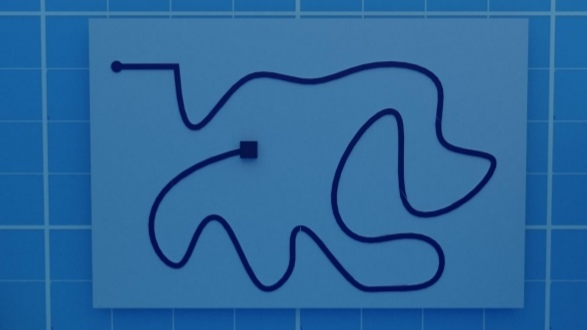

# LINE TRACKING

## Description
This project was made to solve one of the challenges in [Underwater Robotics Competition.](https://www.uwrchallenges.org)
It's about making an ROV (remotely operated vehicle) using a camera detect a circle at the start of a line and then then follow the line without losing it until reaching the square at the end
the project is done by python using specifically openCV library to make image processing opretions on the images of the camera

An Example of the track in a pool

## Code in Action

## Known Issues
* the project does not detect the square at the end and does not stop.
* changing any varible like: the screen width or the speed ;could lead for the project to fail.

